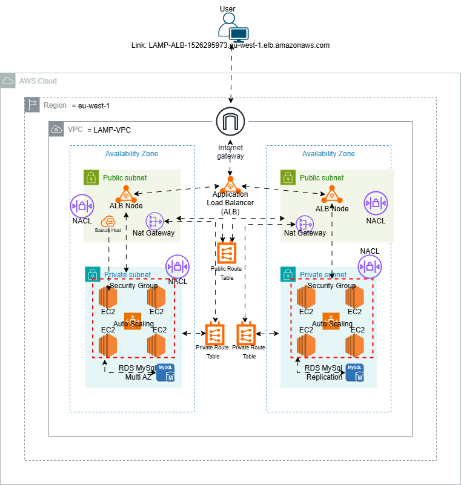
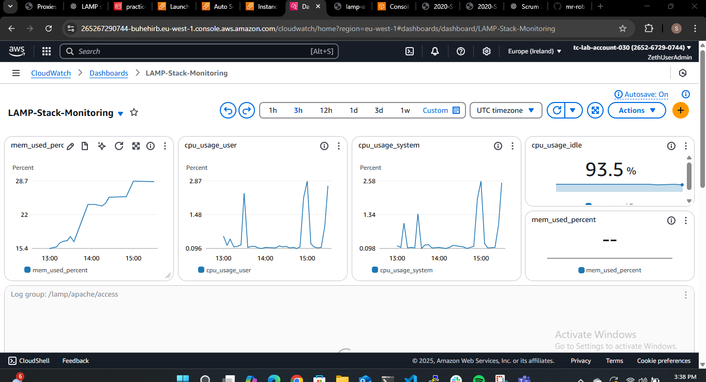
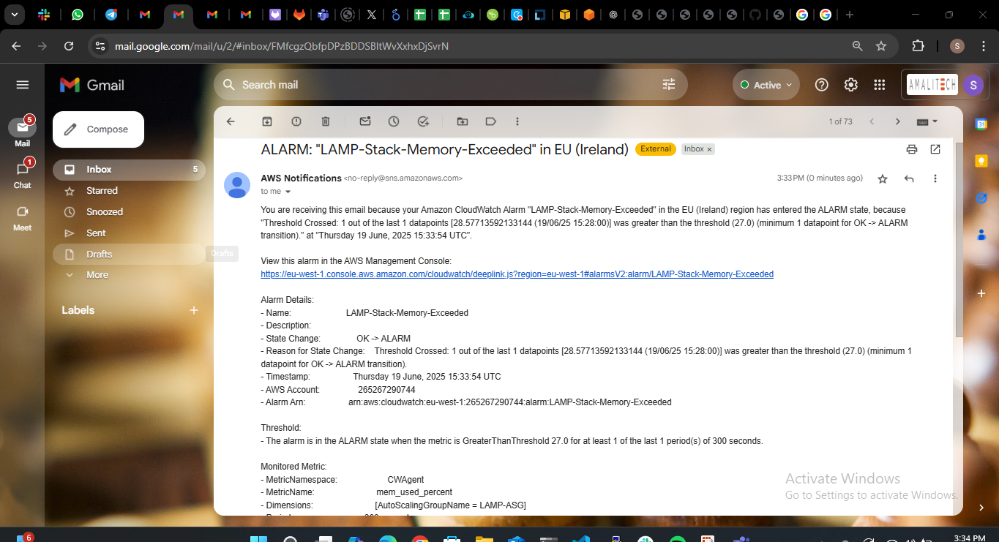
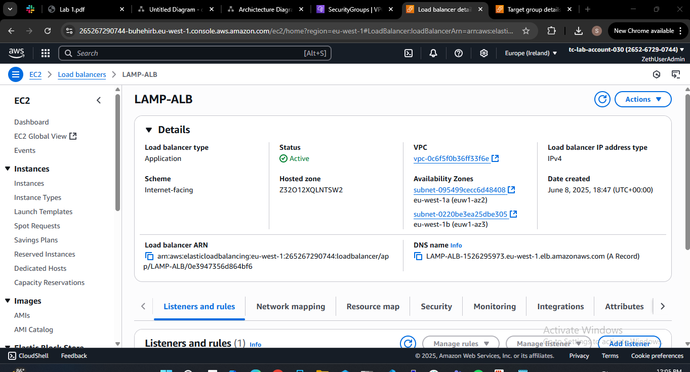

# AWS LAMP Stack Deployment (High Availability)

This project demonstrates the deployment of a **highly available LAMP stack** (Linux, Apache, MySQL, PHP) on AWS using:

- **Multi-AZ RDS MySQL**
- **Auto Scaling EC2 instances**
- **Application Load Balancer**
- **Private/Public subnets**
- **Bastion Host for secure SSH**

---

## Live Application Link:

```
  LAMP-ALB-1526295973.eu-west-1.elb.amazonaws.com
```

## 🧱 Architecture Diagram



## Monitoring and Alerts with Cloudwatch





## Application Load Balancer



## 📁 Project Structure

| Component           | Description                                                  |
| ------------------- | ------------------------------------------------------------ |
| **VPC**             | Custom VPC with 4 subnets (2 public, 2 private across 2 AZs) |
| **Public Subnets**  | ALB, NAT Gateways, Bastion Host                              |
| **Private Subnets** | EC2 instances (Apache + PHP), RDS MySQL                      |
| **Security Groups** | Restrict access to EC2, RDS, ALB                             |
| **Auto Scaling**    | Scales EC2 instances based on demand                         |
| **ALB**             | Routes HTTP traffic to healthy EC2s                          |
| **RDS**             | Multi-AZ MySQL for high availability                         |

---

## 🛠 Setup Steps

### 1. VPC + Subnets

- Create a VPC (e.g. `10.1.0.0/16`)
- Create 2 public subnets (e.g. `10.1.1.0/24`, `10.1.2.0/24`)
- Create 2 private subnets (e.g. `10.1.3.0/24`, `10.1.4.0/24`)
- Create an Internet Gateway and attach to the VPC

### 2. NAT Gateway

- Allocate 2 Elastic IPs
- Create 2 NAT Gateways (1 in each public subnet)
- Create separate route tables for private subnets to use NAT

### 3. Security Groups

- `LAMP-SG-ALB`: Allow HTTP/HTTPS from anywhere
- `LAMP-SG-Bastion`: Allow SSH from your IP
- `LAMP-SG-EC2`: Allow HTTP from ALB and SSH from Bastion
- `LAMP-SG-RDS`: Allow MySQL (3306) from `SG-EC2`

### 4. Bastion Host

- Launch an EC2 in public subnet (AZ1)
- Assign `LAMP-SG-Bastion`, enable public IP
- Use key pair to SSH into private EC2s

### 5. RDS MySQL (Multi-AZ)

- Create an RDS instance with:
  - Multi-AZ enabled
  - Private subnets
  - `LAMP-SG-RDS`
  - Save DB endpoint and credentials

### 6. Application Load Balancer

- Create ALB in public subnets
- Create Target Group for EC2 (port 80)
- Attach to `LAMP-SG-ALB`
- Add Listener rule to forward HTTP to target group

### 7. Launch Template + Auto Scaling Group

- Create Launch Template with:
  - Amazon Linux 2
  - `LAMP-SG-EC2`
  - User Data to install Apache, clone app, create `.env`

**User Data Script (summary):**

```bash
yum install httpd git php ...
git clone https://github.com/mr-robertamoah/simple-lamp-stack.git
cp -r simple-lamp-stack/* .
cat > .env <<EOF ...
```

- Create Auto Scaling Group with:
  - Desired = 2
  - Subnets = both private
  - Attach to ALB target group

---

## 🌐 Access the App

- Visit the ALB DNS name from your browser.
- You should see the LAMP app working, with visit counts from the RDS database.

---

## 🔐 SSH Access (Bastion Workflow)

```bash
ssh -i lamp-key.pem ec2-user@<Bastion-Public-IP>
ssh -i lamp-key.pem ec2-user@<Private-EC2-IP>
```

---

## ✅ App Credentials

Your PHP `.env` file contains:

```
DB_HOST=<Your-DB-Host>
DB_NAME=<Your-DB-Name>
DB_USER=<Your-DB-User>
DB_PASSWORD=<Your-DB-Password>
```

---
